It's important to note that before starting the machine, we are given the credentials for the user `Olivia` to initiate the pentest with them.

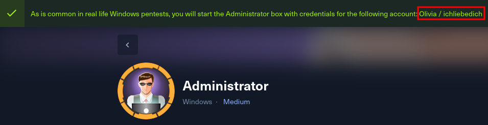


We start the machine by running an `Nmap` scan on the target IP to identify open ports. A quick look reveals that the `Kerberos` and `LDAP` protocols are in use, which suggests that we’re dealing with an Active Directory.


We attempt to access the `FTP` service using the provided credentials, but we are unsuccessful.

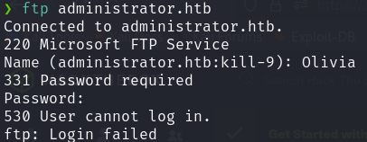

However, when we try listing the available resources in `SMB`, we can see its contents.


While trying to access the different directories, we are only able to enter **NETLOGON**, but the contents of this directory are empty.

On the other hand, in the **SYSVOL** directory, we find a folder named _administrator.htb_ containing a lot of data; however, it doesn’t appear to be easily exploitable.

To continue gathering information through **SMB**, we run `crackmapexec` to list the domain users.


```bash
# Domain Users
Administrator
Guest
krbtgt
olivia
michael
benjamin
emily
ethan
alexander
emma
```

Since we have credentials and a list of users, we decide to use `BloodHound` to explore potential attack paths.

```bash
# Collect data
bloodhound-python -c All -u Olivia -p ichliebedich -d administrator.htb  -ns 10.10.11.42 --zip

# Initialize BloodHound
sudo neo4j console
bloodhound
```

Once in `BloodHound`, we load the data in the upper-right corner.


After the data loads successfully, `BloodHound` displays the graphs.

To proceed, we search for the user **Olivia** in the upper-left corner.


And we mark this user as **Owned**.

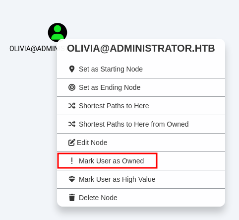

Next, we double-click on the user icon and review the information available in _Node Info_. In the **OUTBOUND OBJECT CONTROL** field, we see a potential lateral movement vector.

Outbound Object Control: `This attribute indicates whether a user or group has permissions allowing them to affect objects in other systems or domains. A value of **1** in this metric means the user or group has direct control over objects that can interact with other resources outside their domain, expanding their network interaction capabilities. This enables **lateral movement** and **privilege escalation** since the attacker can manipulate permissions in connected systems.

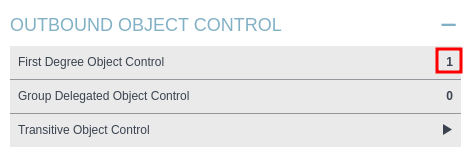

Clicking here shows a PATH between **Olivia** and **Michael**, indicating a possible lateral escalation.


To proceed with the escalation, we simply right-click on the line connecting the two users and select the appropriate command.

In our case, we run the following command:
```bash
net rpc password "MICHAEL" "Password123" -U "ADMINISTRATOR"/"OLIVIA"%"ichliebedich" -S "administrator.htb"
```

This command allows us to change **Michael**’s password to one of our choosing, in this case `Password123`.

To confirm the password change, we use `netexec`.


To continue with the lateral movement, we repeat the same procedure with the user **Michael**, this time aiming to gain access to **Benjamin**.

```bash
net rpc password "BENJAMIN" "Password123" -U "ADMINISTRATOR"/"MICHAEL"%"Password123" -S "administrator.htb"
```

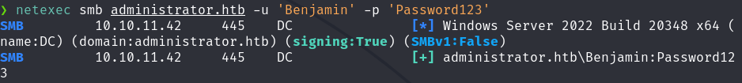

Upon reviewing **Benjamin**'s permissions in `BloodHound`, we see that we cannot continue using the same method to escalate to other users since no similar vulnerabilities are found from **Benjamin**.

However, recall that we previously tried to access **FTP** unsuccessfully. Using **Benjamin**’s credentials, we are now able to log in.

Upon accessing, we find a single backup file, which we download to analyze further.

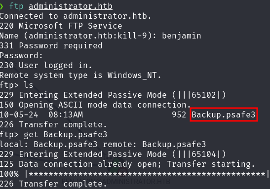

Researching **psafe3**, we find that it is a password database file, similar to Keepass.

Thus, the backup file we retrieved is encrypted, but if we manage to decrypt it, it could contain passwords granting us access to other users.

To decrypt the file, we use a tool called `pwsafe2john`, which converts the file to `John` format for cracking.

```bash
pwsafe2john Backup.psafe3 > Backup_john_mode
```


 
After obtaining the password, we can access the backup file. First, we need to install `PasswordSafe`, which can be downloaded from this [link](https://sourceforge.net/projects/passwordsafe/).

Once installed, we open the application and load the file.

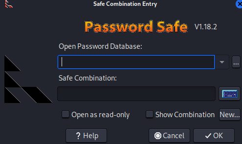

Inside, we find three entries with usernames and passwords.

```bash
alexander:UrkIbagoxMyUGw0aPlj9B0AXSea4Sw
emily:UXLCI5iETUsIBoFVTj8yQFKoHjXmb
emma:WwANQWnmJnGV07WQN8bMS7FMAbjNur
```

Testing these credentials reveals that only **Emily**'s credentials are valid.

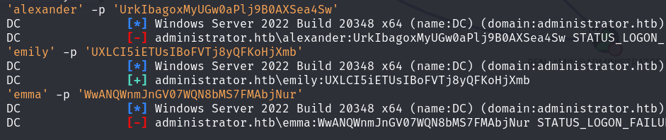

This information is sufficient since, by marking **Emily** as _Owned_ in `BloodHound`, we see that she allows lateral movement to **Ethan**.

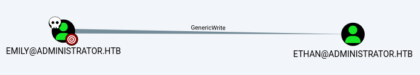

For this attack, we use [targetedKerberoast](https://github.com/ShutdownRepo/targetedKerberoast). If we encounter an error due to the attacker and domain time zones being out of sync, we can use the following command:

```bash
sudo ntpdate -u administrator.htb
```

We then run the command suggested by `BloodHound`.

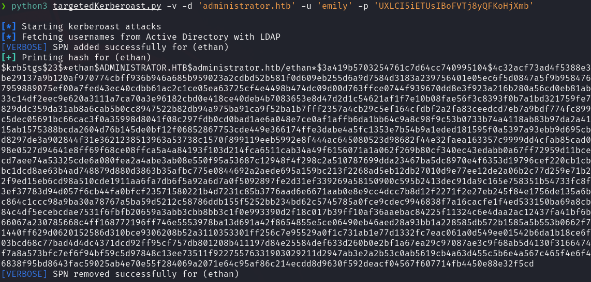

After retrieving the hash, we crack it using `hashcat`.

```bash
hashcat -m 13100 ethan-hash.txt /usr/share/wordlists/rockyou.txt
```


After obtaining **Ethan**’s credentials, we proceed as before, reviewing potential attack vectors in `BloodHound`.


The command to execute is as follows:

```bash
python3 /usr/share/doc/python3-impacket/examples/secretsdump.py 'administrator.htb'/'Ethan':'limpbizkit'@'ADMINISTRATOR.HTB'
```

This command displays the hashes for all domain users.

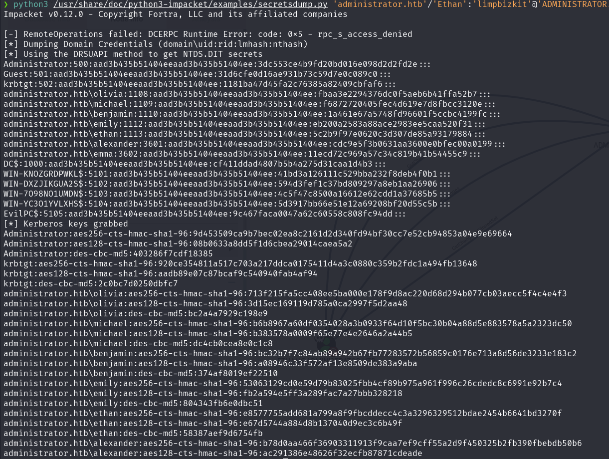

As observed in the initial `Nmap` scan, **WinRM** is configured, so we run `evil-winrm` using the **NTLM** hash for **administrator**.

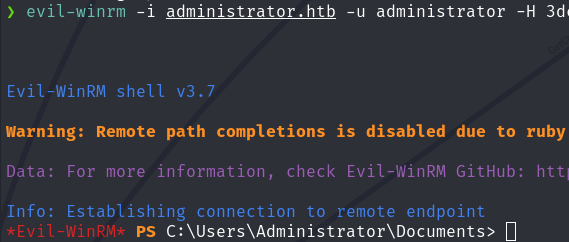

Finally, we retrieve the **user** flag in `C:\Users\emily\Desktop\user.txt`.

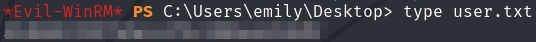

Finally, we retrieve the **user** flag in `C:\Users\emily\Desktop\user.txt`.

