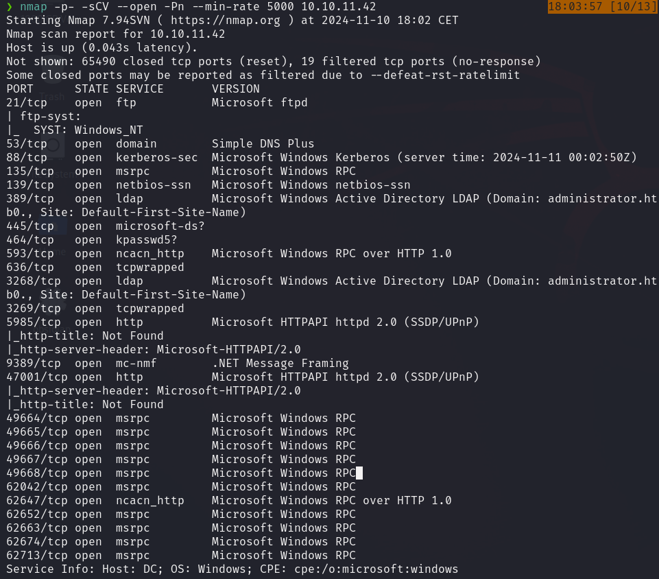
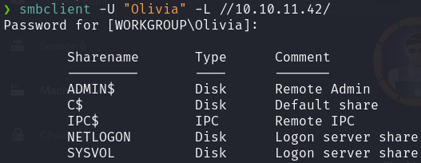
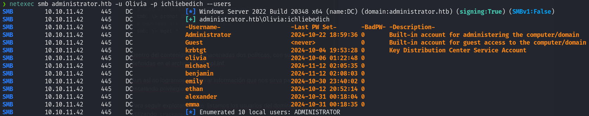
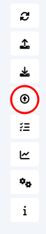
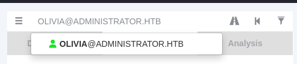
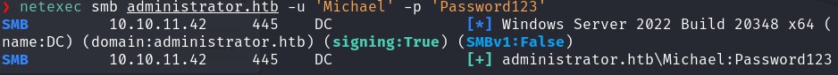
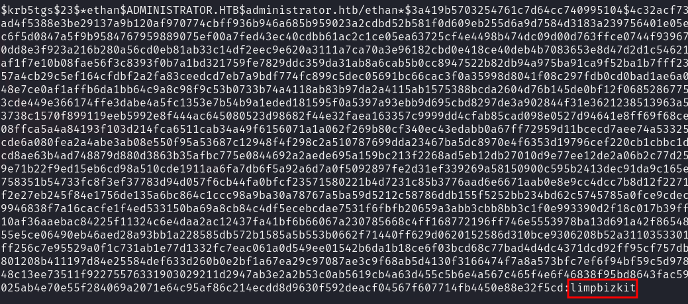
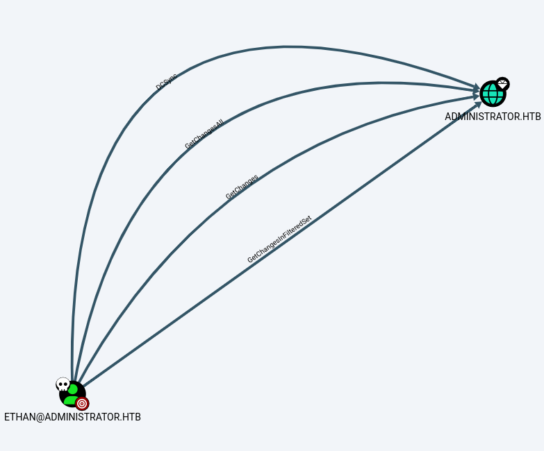
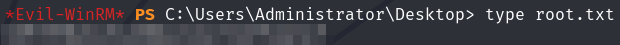

Es importante destacar que antes de iniciar la máquina se nos dan las credenciales del usuario `Olivia` para iniciar el pentest con ellas.


Iniciamos la máquina ejecutando un escaneo `Nmap` sobre la IP del objetivo para identificar los puertos abiertos. Con un vistazo rápido, observamos que se está utilizando el protocolo `Kerberos` y `LDAP`, lo que sugiere que estamos frente a un directorio activo.


Intentamos acceder al servicio `FTP` con las credenciales proporcionadas, pero no tenemos éxito.


Sin embargo, al intentar listar los recursos disponibles en `SMB`, logramos ver su contenido.



Al intentar acceder a los distintos directorios, solo conseguimos acceso a **NETLOGON**, pero el contenido de este directorio está vacío.

Por otro lado, en el directorio **SYSVOL** encontramos una carpeta llamada _administrator.htb_ con mucho contenido; no obstante, este contenido no parece ser fácilmente vulnerable.

Para continuar con la extracción de información a través de **SMB**, ejecutamos `crackmapexec` para listar los usuarios del dominio.

```bash
# Domain Users
Administrator
Guest
krbtgt
olivia
michael
benjamin
emily
ethan
alexander
emma
```

Como ya contamos con credenciales y una lista de usuarios, decidimos utilizar `BloodHound` para buscar posibles vectores de ataque.

```bash
# Collect data
bloodhound-python -c All -u Olivia -p ichliebedich -d administrator.htb  -ns 10.10.11.42 --zip

# Initialize BloodHound
sudo neo4j console
bloodhound
```

Como ya contamos con credenciales y una lista de usuarios, decidimos utilizar `BloodHound` para buscar posibles vectores de ataque.



Después de que los datos se carguen correctamente, se nos muestran los gráficos de `BloodHound`.

Para continuar, buscamos al usuario **Olivia** en la esquina superior izquierda.


Y marcamos este usuario como **Owned**.


Luego, hacemos doble clic sobre el icono del usuario y revisamos la información disponible en _Node Info_. En el campo **OUTBOUND OBJECT CONTROL**, vemos un posible vector de movimiento lateral.

Outbound Object Control: `Este atributo muestra si un usuario o grupo tiene permisos que le permiten afectar objetos en otros sistemas o dominios. Un valor de **1** en esta métrica indica que el usuario o grupo tiene control directo sobre objetos que pueden hacer solicitudes a otros recursos fuera de su dominio, ampliando sus capacidades de interacción en la red. Esto facilita el **movimiento lateral** y la **escalada de privilegios**, ya que el atacante puede manipular permisos en otros sistemas conectados.


Al hacer clic, vemos un PATH entre el usuario **Olivia** y el usuario **Michael**, lo que indica una posible escalada lateral entre ellos.


Para realizar la escalada, basta con hacer clic derecho en la línea que une a los dos usuarios y elegir el comando adecuado.

En nuestro caso, ejecutamos el siguiente comando:
```bash
net rpc password "MICHAEL" "Password123" -U "ADMINISTRATOR"/"OLIVIA"%"ichliebedich" -S "administrator.htb"
```

Con este comando, cambiamos la contraseña de **Michael** a una de nuestra elección, en este caso `Password123`.

Para validar que el cambio se ha realizado correctamente, utilizamos `netexec`.



Para continuar con el movimiento lateral, repetimos el procedimiento con el usuario **Michael**, esta vez intentando obtener acceso al usuario **Benjamin**.

```bash
net rpc password "BENJAMIN" "Password123" -U "ADMINISTRATOR"/"MICHAEL"%"Password123" -S "administrator.htb"
```


Al revisar los permisos de **Benjamin** en `BloodHound`, vemos que no podemos usar el mismo método para llegar a otros usuarios, ya que no encontramos vulnerabilidades similares desde **Benjamin**.

Sin embargo, recordemos que anteriormente intentamos acceder a **FTP** sin éxito. Con las credenciales de **Benjamin**, logramos autenticarnos correctamente.

Al acceder, encontramos un único archivo de Backup, que descargamos para examinarlo con mayor detalle.


Investigando sobre **psafe3**, descubrimos que se trata de un archivo de base de datos de contraseñas, similar a Keepass.

Así, el archivo de Backup obtenido está cifrado, pero si logramos descifrarlo, posiblemente contenga contraseñas que nos den acceso a otros usuarios.

Para descifrarlo, encontramos una herramienta llamada `pwsafe2john`, que convierte el archivo al formato `John` para su crakeo.

```bash
pwsafe2john Backup.psafe3 > Backup_john_mode
```


 
Después de obtener la contraseña, podemos acceder al archivo de Backup. Primero, debemos instalar `PasswordSafe`; para ello, descargamos el paquete desde este [Link](https://sourceforge.net/projects/passwordsafe/).

Una vez instalado, abrimos la aplicación y cargamos el archivo.


Dentro, encontramos tres entradas con nombres de usuario y contraseñas.

```bash
alexander:UrkIbagoxMyUGw0aPlj9B0AXSea4Sw
emily:UXLCI5iETUsIBoFVTj8yQFKoHjXmb
emma:WwANQWnmJnGV07WQN8bMS7FMAbjNur
```

Al probar las credenciales obtenidas, verificamos que solo las de **Emily** son válidas.


Esta información es suficiente, ya que, al marcar a **Emily** como _Owned_ en `BloodHound`, vemos que desde este usuario se puede realizar un movimiento lateral hacia **Ethan**.


Para este ataque, utilizamos [targetedKerberoast](https://github.com/ShutdownRepo/targetedKerberoast). Si ocurre un error debido a la diferencia de zona horaria entre el atacante y el dominio, ejecutamos el siguiente comando:

```bash
sudo ntpdate -u administrator.htb
```

Entonces, ejecutamos el comando sugerido por `BloodHound`.


Una vez tenemos el hash, lo crackeamos con `hashcat`.

```bash
hashcat -m 13100 ethan-hash.txt /usr/share/wordlists/rockyou.txt
```



Después de obtener las credenciales de **Ethan**, seguimos el mismo proceso para revisar los vectores de ataque en `BloodHound`.



El comando a ejecutar es el siguiente:

```bash
python3 /usr/share/doc/python3-impacket/examples/secretsdump.py 'administrator.htb'/'Ethan':'limpbizkit'@'ADMINISTRATOR.HTB'
```

Este comando muestra los hashes de todos los usuarios del dominio.


Como observamos al inicio en el escaneo `Nmap`, **WinRM** está configurado. Por lo tanto, ejecutamos `evil-winrm` utilizando el hash **NTLM** del usuario **administrator**.


Finalmente, obtenemos la flag de **user** en el directorio `C:\Users\emily\Desktop\user.txt`.


Y la flag de **root** en el directorio `C:\Users\Administrator\Desktop\root.txt`.

