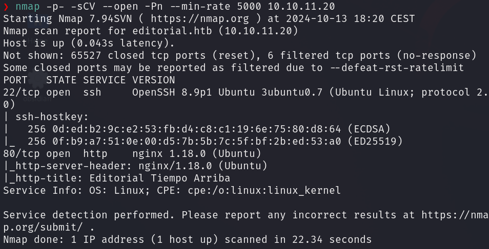
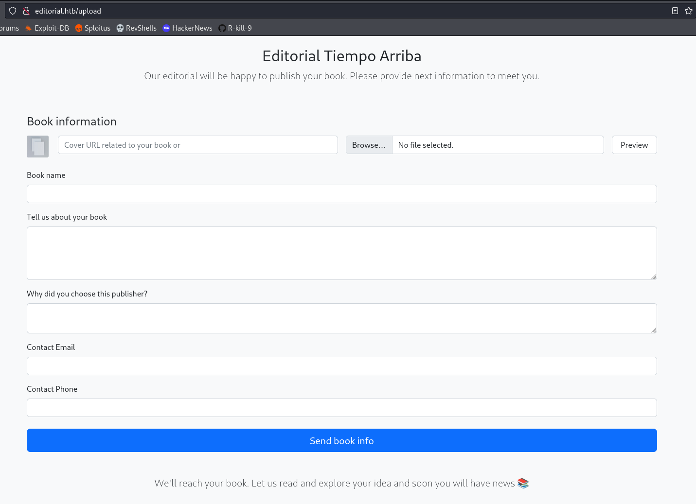
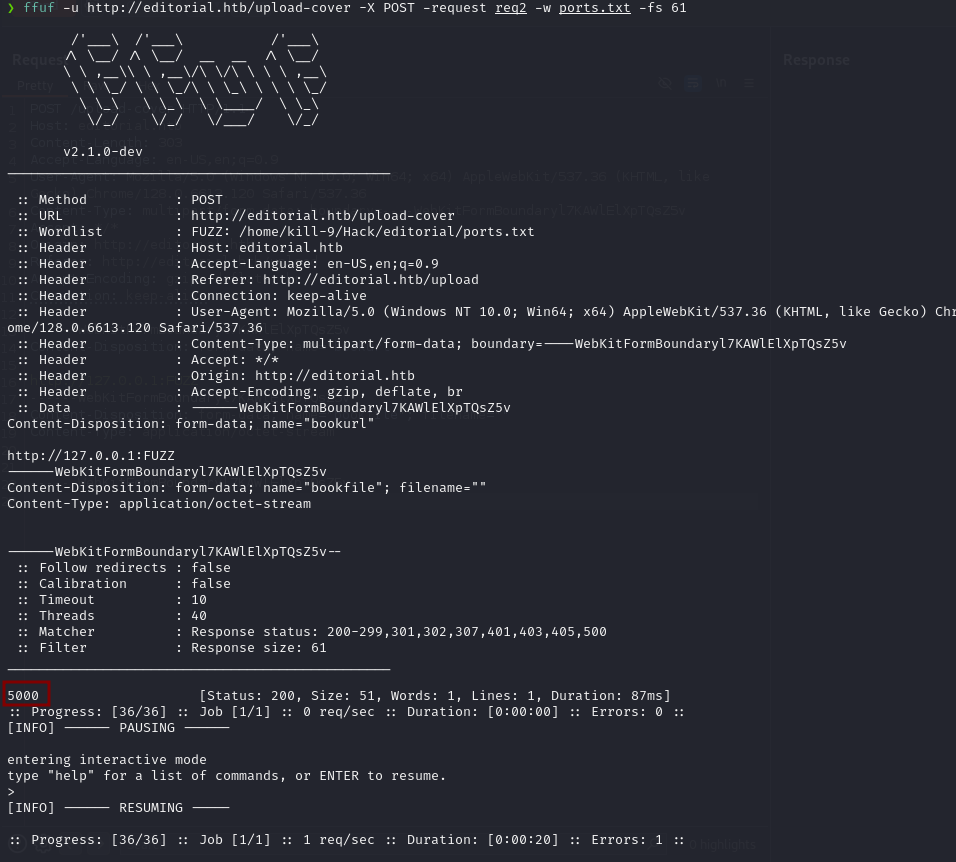
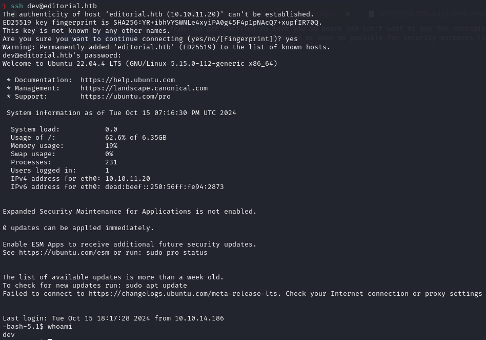
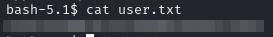
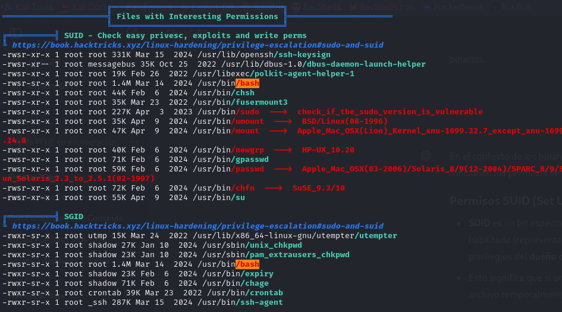

# User flag

Para empezar, ejecutamos un nmap sobre la IP de la máquina target con lo que vemos cuales son los puertos que tiene abiertos.



Observamos que el puerto 80 está abierto por lo que consultamos la página web.
Como de costumbre, hacemos fuzzing de directorios y encontramos un potencial vector de ataque en el directiorio `upload`.
```bash
gobuster dir -u http://editorial.htb  -w /usr/share/wordlists/dirbuster/directory-list-lowercase-2.3-medium.txt -t 200
```


Después de intentar subir varios tipos de archivos con payloads maliciosos sin éxito, me fijé en el otro campo de input, que nos permite insertar una URL. Lo primero que se me ocurrió fue ejecutar un SSRF buscando archivos de configuración típicos.


Después de que esto no funcionara decidí probar con los puertos. Para ello capturé la petición con Burpsuite, creé un archivo con todos los puertos y utilicé `ffuf`para ver si encontraba algun puerto accesible.
```bash
ffuf -u http://editorial.htb/upload-cover -X POST -request request.txr -w ports.txt -fs 61
```


Si lanzamos la petición haciendo referencia a este puerto y capturamos la respuesta con Burpsuite, vemos que se nos proporciona un endpoint específico.


Si visitamos dicho endpoint en el navegador se nos descarga un archivo con el siguiente contenido:
```bash
{"messages":[{"promotions":{"description":"Retrieve a list of all the promotions in our library.","endpoint":"/api/latest/metadata/messages/promos","methods":"GET"}},{"coupons":{"description":"Retrieve the list of coupons to use in our library.","endpoint":"/api/latest/metadata/messages/coupons","methods":"GET"}},{"new_authors":{"description":"Retrieve the welcome message sended to our new authors.","endpoint":"/api/latest/metadata/messages/authors","methods":"GET"}},{"platform_use":{"description":"Retrieve examples of how to use the platform.","endpoint":"/api/latest/metadata/messages/how_to_use_platform","methods":"GET"}}],"version":[{"changelog":{"description":"Retrieve a list of all the versions and updates of the api.","endpoint":"/api/latest/metadata/changelog","methods":"GET"}},{"latest":{"description":"Retrieve the last version of api.","endpoint":"/api/latest/metadata","methods":"GET"}}]}
```
 Después de visitar varios de los endpoints realizando el SSRF de la misma forma observamos que en al hacer la petición para el endpoint `http://localhost:5000/api/latest/metadata/messages/authors` encontramos el siguiente mensaje:
```bash
{"template_mail_message":"Welcome to the team! We are thrilled to have you on board and can't wait to see the incredible content you'll bring to the table.\n\nYour login credentials for our internal forum and authors site are:\nUsername: dev\nPassword: dev080217_devAPI!@\nPlease be sure to change your password as soon as possible for security purposes.\n\nDon't hesitate to reach out if you have any questions or ideas - we're always here to support you.\n\nBest regards, Editorial Tiempo Arriba Team."}
```
Si probamos a acceder con ssh usando las credenciales del mensaje tenemos éxito.



Y ya con esto podemos obtener la flag de user.



# Root flag
Para empezar la escalada de privilegios intenté ejecutar `sudo -l` pero nuestro usuario no está en el grupo de sudoers. Posteriormente listé el directorio `/home` encontrando el usuario `prod`.

Para facilitar el proceso de escalada de privilegios utilizamos **linpeas**. Al ejecutarlo encontramos lo siguiente: 



El archivo `/usr/bin/bash` tiene el SUID bit activo, lo que significa que culquier usuario que ejecute el archivo lo hará con los permisos del dueño del archivo, en este caso root. 

Así entonces, si ejecutamos el comando `/usr/bin/bash -p` spawneamos una nueva shell con privilegios de root.


