Iniciamos realizando un `Nmap` sobre la máquina target para revelar sus puertos abiertos, que resultan ser los puertos 21, 22, 80 y 3306.

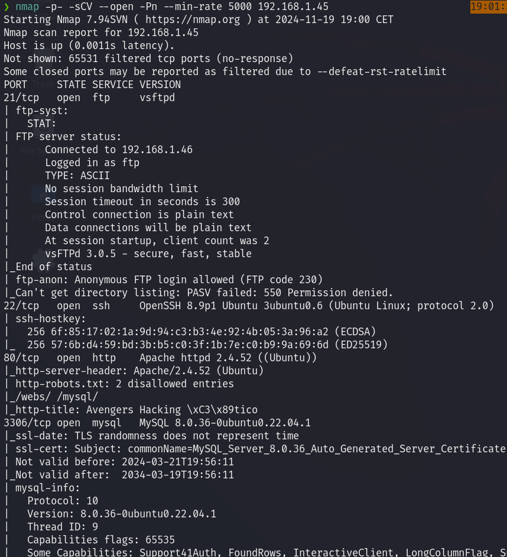

Accedemos al puerto 21 utilizando las credenciales `Anonymous` con éxito. Al listar su contenido, obtenemos un archivo con una flag y un archivo zip que dice contener credenciales.

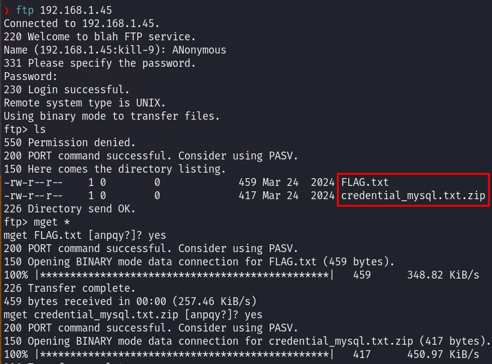

Al hacer un `cat` de la flag, se nos indica que es la flag 3/9, pero no nos aporta ninguna información adicional.

Al intentar descomprimir el archivo zip, se nos pide introducir una contraseña que desconocemos. Intentamos crackearla utilizando `John` pero no tenemos éxito.

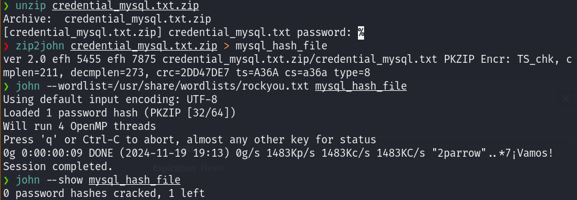

De momento dejamos este vector de ataque para más adelante y buscamos otros posibles vectores de ataque.

Accedemos al puerto 80, donde encontramos una página web.

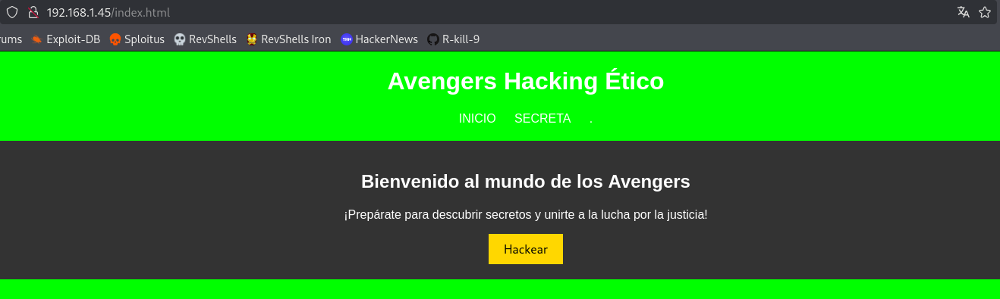

Al revisar su código fuente, encontramos una pista que nos sugiere visitar el directorio `/code`.

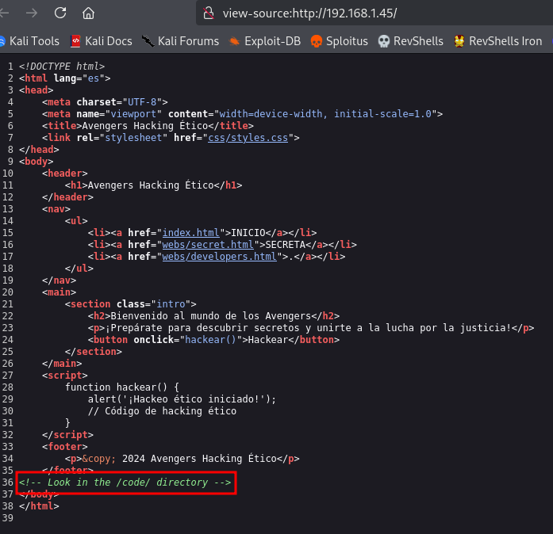

Al visitar el directorio, encontramos un archivo llamado `code.html`. En su código fuente, hay un mensaje que no nos resulta útil para encontrar posibles vulnerabilidades, por lo que decidimos seguir explorando la página web.

Al acceder a la opción `SECRETA` disponible en la página principal, se nos redirige a otra página donde hay un campo para realizar una búsqueda.

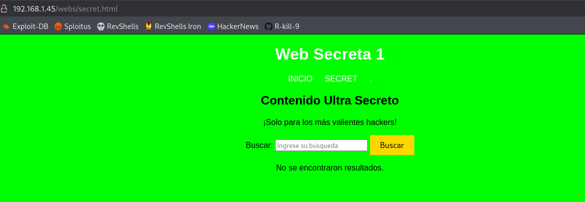

El campo de búsqueda parece no funcionar, pero si revisamos el código fuente de esta página, encontramos un archivo `js` interesante.

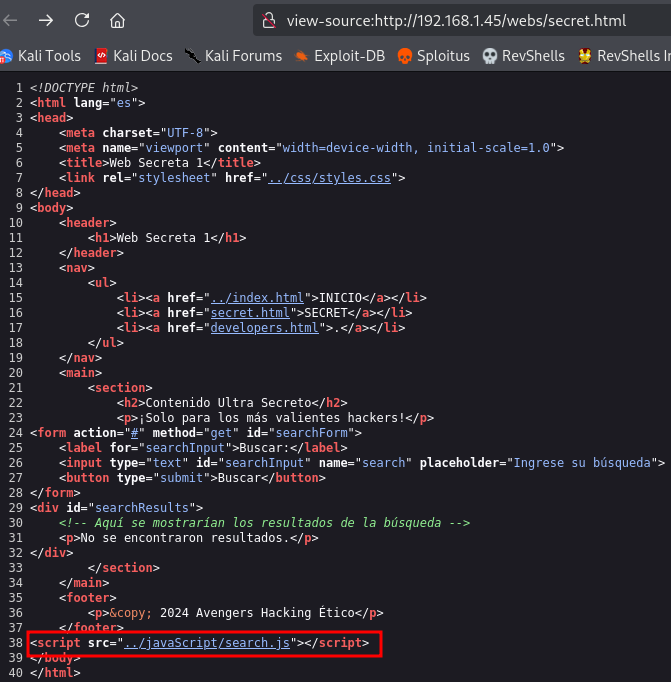

Dentro de este archivo descubrimos que el buscador no funciona correctamente y devuelve el resultado **Hulk** si ingresamos cierto input.

Como en este punto no tenemos otro vector de ataque, realizamos un **fuzzing** a la página web para descubrir nuevos directorios, lo que revela varios de ellos.

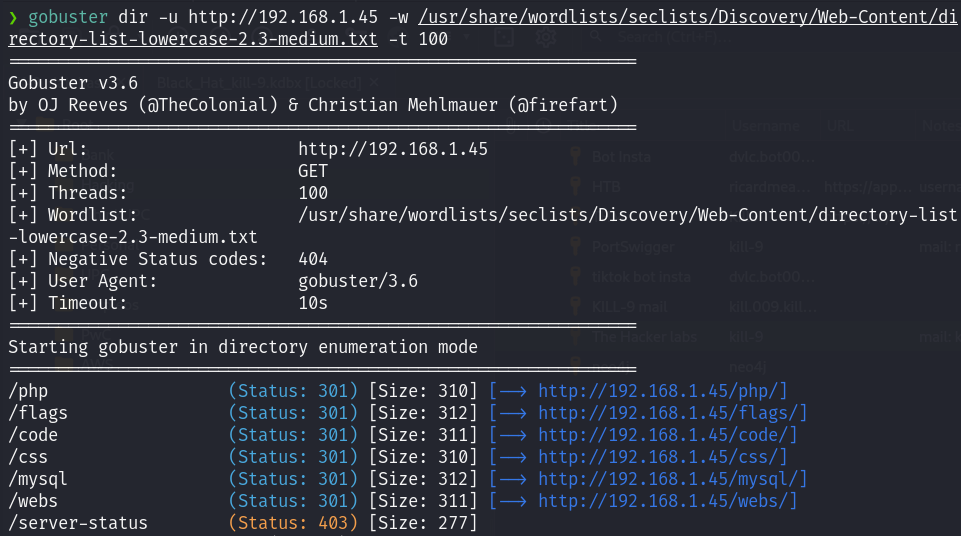

En el directorio `mysql` encontramos un archivo HTML. Al visitarlo, nos lleva a una página web y, al revisar su código fuente, encontramos la contraseña de un usuario que está aparentemente oculto.

La contraseña parece estar en **Base64**, por lo que la decodificamos.

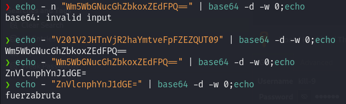

Ahora, con el usuario `hulk` y su contraseña, podemos acceder a la máquina víctima a través de **ssh**.

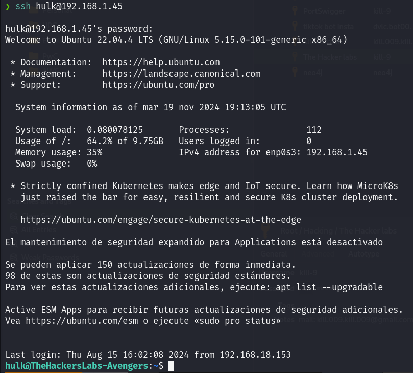

Al intentar imprimir la flag de `user`, vemos que no está contenida en `user.txt`, y se nos indica que podemos encontrarla en el mismo directorio.

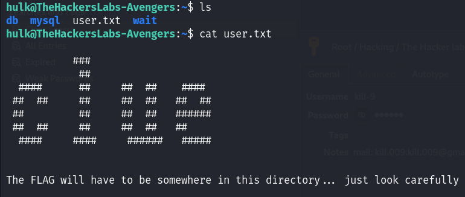

Después de una búsqueda, encontramos que el archivo llamado `shit_how_they_did_know_this_password.txt` contiene la contraseña para desencriptar el archivo zip que encontramos inicialmente.

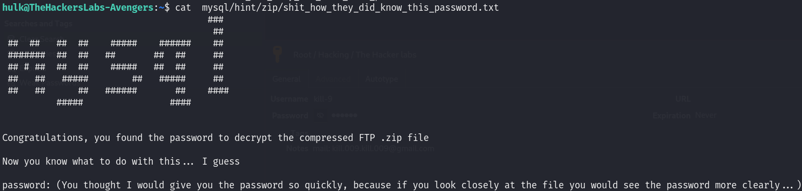

Desencriptamos el archivo zip, encontrando una pista para acceder a la base de datos.

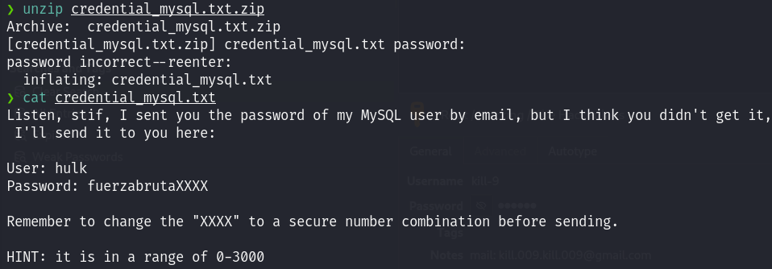

Se nos dice que la contraseña contiene cuatro dígitos, por lo que decidimos crear un diccionario con todas las combinaciones posibles para realizar un ataque de fuerza bruta.

Existen varias maneras de crear este diccionario. En mi caso, utilicé un pequeño script en Python para generarlo.

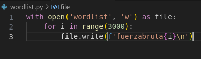
Al conectarnos a la base de datos desde la máquina víctima, encontramos las siguientes bases de datos:

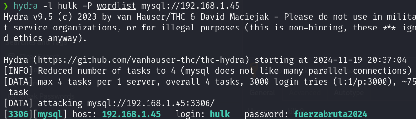

Al conectarnos a la DB desde la máquina víctima encontramos las siguientes bases de datos:

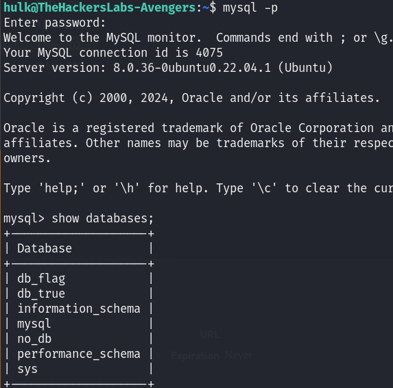

En la base de datos `no_db` encontramos una serie de usuarios y la contraseña encriptada de `root`.

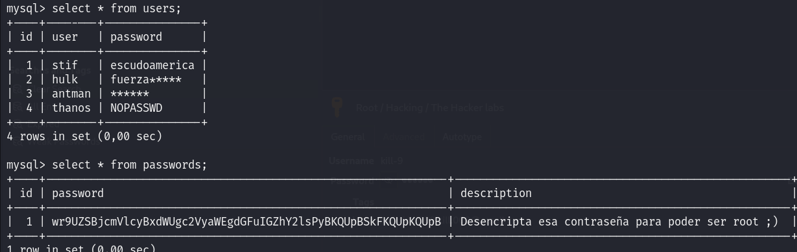

Sin embargo, al desencriptar la contraseña de `root` en **Base64**, obtenemos un mensaje indicando que no es la contraseña correcta. Así que cambiamos de usuario a `stif`, cuya contraseña sí es válida.

Ya con los privilegios de **stif**, revisamos qué comandos puede ejecutar con privilegios de **root**, observando que tiene permiso para ejecutar `/usr/bin/bash`.

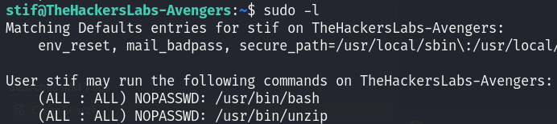

De esta manera, creamos una nueva instancia de **bash** y obtenemos acceso al usuario **root**, obteniendo así las dos flags.

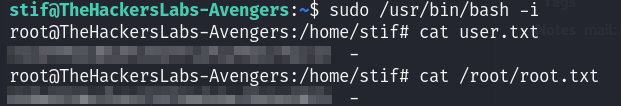

