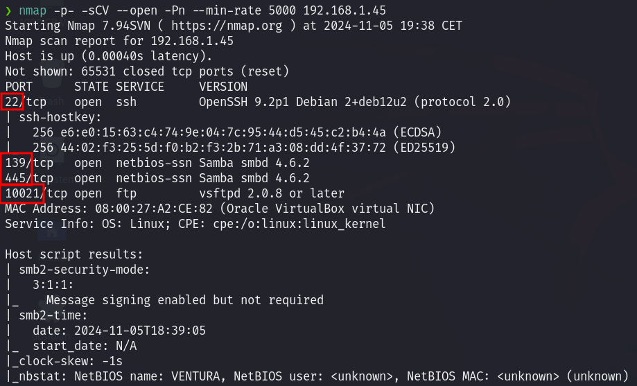
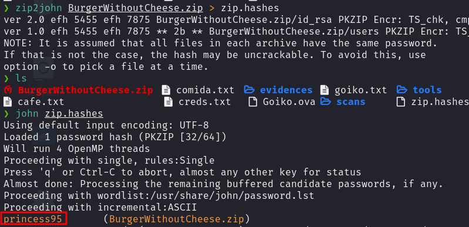

# User flag

Iniciamos realizando un `Nmap` sobre la máquina víctima para identificar los puertos abiertos.
Descubrimos que los puertos accesibles son el `22,139,445, 10021`. 



Dado que la versión de SSH configurada en el puerto 22 no es vulnerable, pasamos a revisar los puertos 139 y 445, que están asociados a SMB.

Para revisar el contenido de SMB usamos `smbclient` sin especificar usuario (-N) y listando el contenido (-L).


En la salida del comando recibimos varios Shernames no comunes, así que procedemos a listar su contenido.


Al listar el contenido del directorio `food`, encontramos un archivo con credenciales. Hacemos un `get` de este archivo para poder visualizar su contenido, pero al hacerlo, encontramos el siguiente mensaje:


Tal y como se nos indica en el mensaje, tendremos que hacer un esfuerzo adicional para conseguir las credenciales. Por lo tanto, listamos los otros dos directorios para intentar encontrar más información útil.

Para el directorio `dessert`, encontramos tres archivos que obtenemos para revisar.


Al revisar el contenido de los archivos, observamos algunos mensajes extraños que no nos revelan información sensible.

Siguiendo el mismo procedimiento para el directorio `menu`, conseguimos encontrar un usuario en el archivo `.cafesinleche`.


Seguidamente, intentamos conectarnos por SSH utilizando estas credenciales, y tenemos éxito.


Para mayor comodidad, es recomendable realizar un `upgrade` de la shell:

```bash
python3 -c 'import pty; pty.spawn("/bin/bash")'
```

Una vez dentro, para proceder con la escalada de privilegios, intentamos acceder al puerto FTP que vimos abierto al realizar el Nmap. Allí, utilizando las credenciales del usuario `marmai`, encontramos un archivo ZIP llamado `BurgerWithoutCheese.zip`.


 
 Sin embargo, al intentar acceder a su contenido, se nos solicita una contraseña de `id_rsa` que no tenemos.

A pesar de esto, no significa que no podamos obtener el contenido dentro del archivo ZIP.

Primero necesitamos convertir el contenido a formato `john`, así que utilizamos `zip2john` para ello. Luego, ejecutamos `john` sobre el archivo donde guardamos el contenido y obtenemos la contraseña: `princess95`.



Extraemos el contenido del archivo `BurgerWithoutCheese.zip`, del cual obtenemos un archivo `id_rsa` y la siguiente lista de usuarios:

```bash
nika                                                          caroline                                                      gurpreet
santi
marsu
```

Para seguir con la escalada de privilegios, intentamos acceder vía SSH a la máquina con alguno de estos usuarios y el `id_rsa` proporcionado.

Al intentarlo, vemos que no podemos acceder con el `id_rsa` proporcionado, así que procedemos a intentar crackearlo usando `john` otra vez para averiguar la contraseña.


Continuamos intentando acceder con los distintos usuarios disponibles, y conseguimos acceso con `gurpreet`, obteniendo la flag de usuario.


# Root flag

En el mismo directorio donde encontramos la flag de usuario, vemos un archivo llamado `nota` con el siguiente contenido:

```bash
- ENGLISH = The database has very simple hashes, please configure it well. 

- CASTELLANO = La base de datos tiene hashes muy sencillos, por favor configuralo bien.

- CATALA = La base de dades te hashes molt senzills, si us plau configura be.
```

Ejecutando `mysql --version` vemos que hay una base de datos de MariaDB instalada, a la que podemos conectarnos usando el usuario `gurpreet`.


Buscando en la base de datos `secta`, encontramos los hashes de los usuarios `carline` y `nika`.


Con `hash-identifier`vemos que los hashes están siendo almacenados usando *MD5*.


Para descifrar las contraseñas, guardamos ambos hashes en un archivo y usamos `Hashcat` con el siguiente comando:

```bash
hashcat -m 0 hashes /usr/share/wordlists/rockyou.txt
```

Y conseguimos las siguientes contraseñas.


Una vez dentro de la cuenta de `nika`, ejecutamos `sudo -l` para ver si tenemos permisos de ejecución como root sobre algún archivo.


Como podemos ver en el script, se hace una llamada a `find` sin usar rutas absolutas, lo que nos permite ejecutar un ataque de **PATH HIJACKING**.

Para ejecutarlo, creamos un archivo find con el siguiente contenido en su interior:

```bash
chmod u+s /bin/bash
```

De esta manera, al añadir al `PATH` el directorio `/tmp` donde tenemos nuestro archivo `find` almacenado, se ejecutará el comando insertado en su interior con privilegios de root.

De este modo, nuestro usuario tendrá permisos para ejecutar `/bin/bash` como root, lo que nos permitirá acceder a la flag de root.


Para terminar, un agradecimiento a `Rev3rK1hll`, el creador de esta máquina, quien tiene varias otras disponibles en [TheHackerLabs](https://thehackerslabs.com/).
