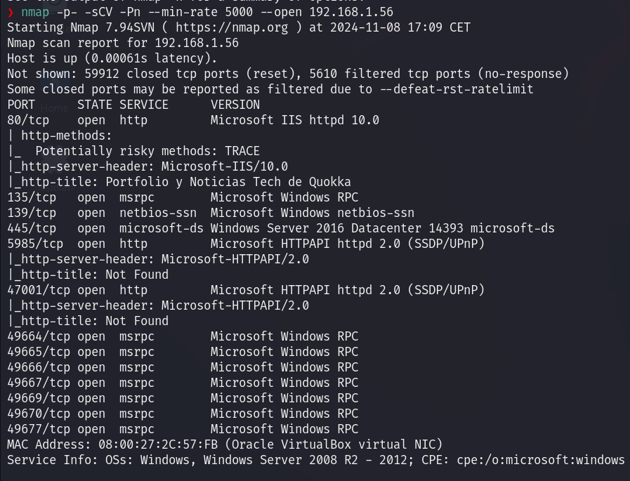

# User flag

Iniciamos la máquina ejecutando un Nmap para observar cuáles son las IPs de los dispositivos de nuestra red. En mi caso, la IP víctima resulta ser la 192.168.1.56, para la cual lanzamos un Nmap para extraer información sobre sus puertos.



Observamos que mediante HTTP hay accesible la siguiente página web:


Ya que no vemos ningún tipo de interacción, pasamos directamente a intentar descubrir directorios no visibles con `gobuster`, encontrando el directorio **avatar**.


De todas maneras, al intentar acceder recibimos un error 403, indicando que se nos deniega el acceso por falta de permisos.

Abandonando el vector de ataque vía página web, pasamos a revisar los puertos relacionados con SMB. En el `Nmap` hemos recibido como resultado que se está usando **Windows Server 2016**, lo que puede ser una versión de Windows vulnerable al famoso exploit **EternalBlue**.

Para llevar a cabo la verificación de esta vulnerabilidad, ejecutamos un script de Nmap, el cual nos acaba validando nuestras sospechas.


De todas maneras, al intentar ejecutar el exploit de EternalBlue con Metasploit, se nos indica que la máquina no es vulnerable a dicho ataque.


Aun así, seguimos intentando explotar el puerto relacionado con SMB, ya que parece ser el vector de entrada. Así que accedemos y vemos su contenido con `smbclient`.


Para descargar todos los documentos disponibles en `SMB`, podemos ejecutar esta secuencia de comandos:

```bash
# Enable recursive download
smb: \> recurse ON
# Turn off interactive prompts for each file
smb: \> prompt OFF
# Download all files and folders
smb: \> mget *
```

Analizando el contenido de los directorios descargados, vemos unos archivos con extensión _.bat_ que deben ser analizados.


En estos archivos observamos un código que se encarga de ejecutar de forma oculta un comando en PowerShell que descarga y ejecuta un script malicioso desde una dirección externa, estableciendo una reverse shell.


De esta manera, primero modificamos el archivo `mantenimiento.bat` introduciendo nuestra IP y un puerto que abriremos para que se obtenga el archivo. Seguidamente, creamos un archivo llamado `shell.ps1` donde introducimos la reverse shell con la IP de nuestra máquina y un puerto a nuestra elección.


Una vez realizados estos cambios introducimos usando SMB el archivo `mantenimiento.bat` modificado.


También, abrimos un puerto para que el script pueda acceder a nuestra máquina y obtener la reverse shell, y otro puerto para que se realice la conexión para la reverse shell.

```bash
python3 -m http.server 8000
nv -lvnp 4444
```

Después de esperar un minuto, ya nos llega la conexión al listener que hemos abierto, obteniendo la reverse shell como administrador.
